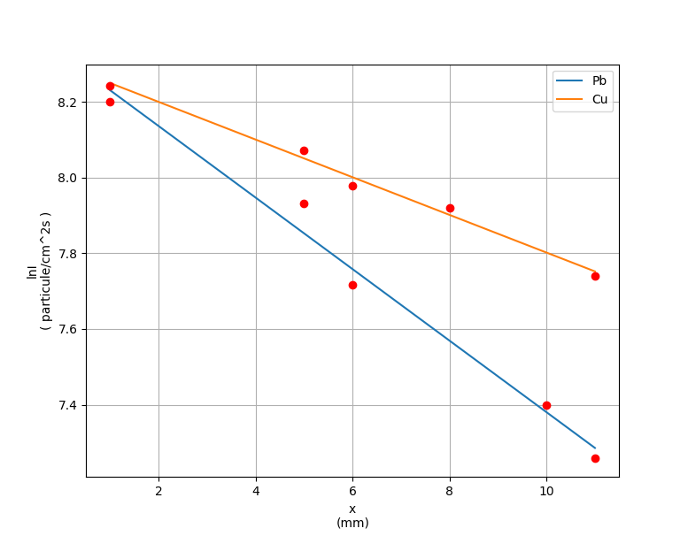

# DETERMINAREA COEFICIENTULUI DE ATENUARE MASICĂ PENTRU RADIATIA GAMMA

### Documentația laboraturului se află în fișierul [pdf](.), iar datele experimentale obținute, cât și variabilele calculate pot fi găsite în fișierul [xlsx](./Spectroscopia_radiatiilor_BETA_tabel.xlsx)

Pentru a vizualiza interpretarea grafică a dependenței dintre energia particulelor β și numărul acestora de impulsuri se poate rula comanda:
```
    python beta.py
``` 
<br>


